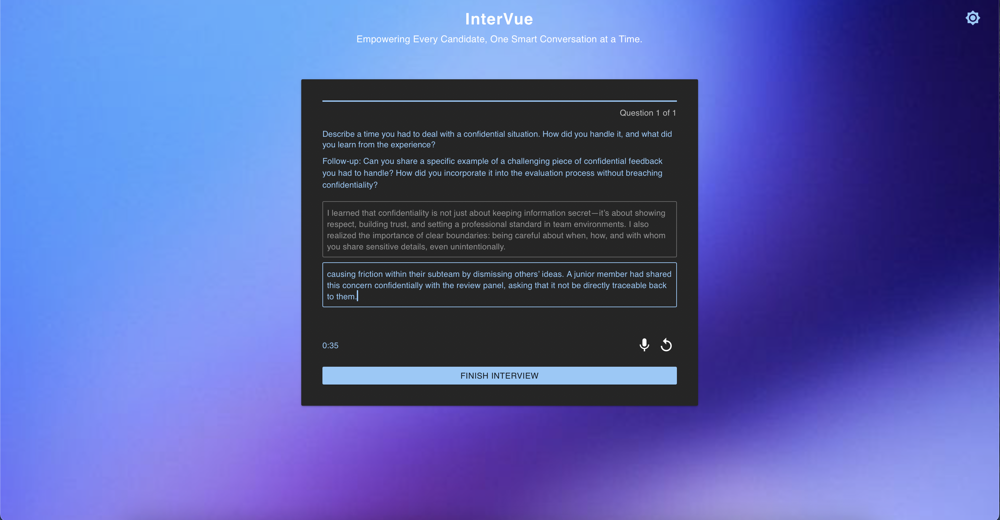
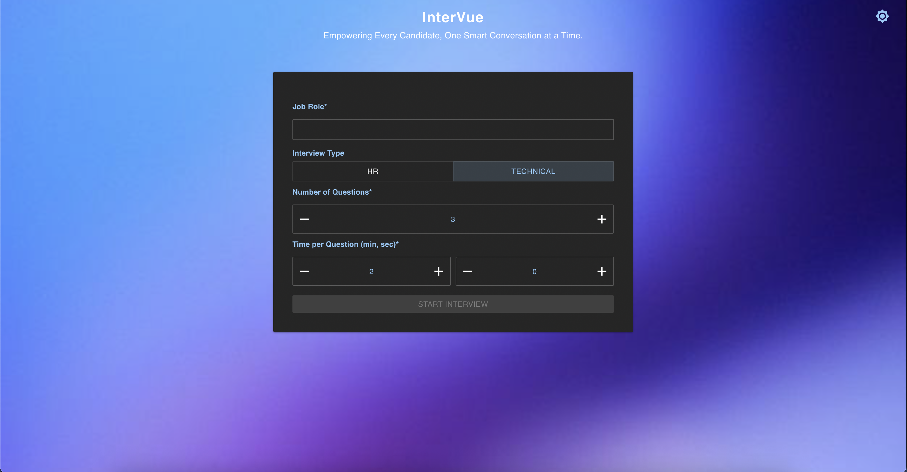
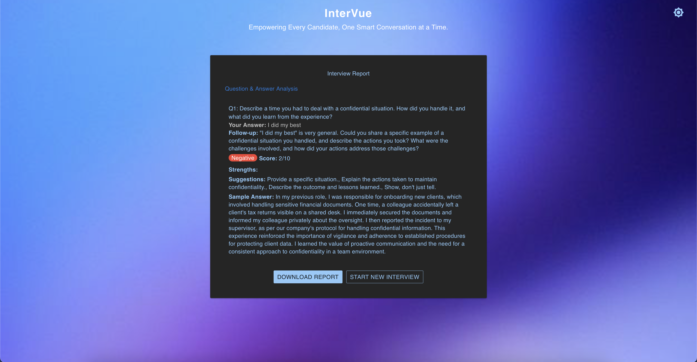

# Intervue - AI-Powered Interview Practice

Intervue is a full-stack web application that helps users practice interviews using AI-powered question generation and evaluation. The application uses Google's Gemini 1.5 Pro API for generating interview questions and evaluating responses.

## Features

- Dynamic interview question generation based on job role and interview type
- Real-time speech-to-text input (Web Speech API)
- **Follow-up questions**: If your answer is vague, the AI will ask a follow-up and lock your initial answer
- **Distinct answer fields**: Main and follow-up answers are kept separate and editable only at the right time
- **Timer per question**: Customizable (minutes and seconds), auto-advances to next question/report when time is up
- **Retry logic**: Reset main or follow-up answer independently, with timer behavior tailored to each
- **Comprehensive evaluation report**: See feedback and download as PDF
- **Modern UI/UX**: Material UI, smooth transitions, bold section headers, toggle buttons, and theme support
- **Dark/Light mode toggle**
- **Responsive design**
- **Smooth animations and transitions**

## Screenshots
### Landing Page


### Interview Page


### Report Page



## Tech Stack

- Frontend: React, Material UI, Framer Motion
- Backend: Node.js, Express
- AI: Google Gemini 1.5 Pro API
- Speech Recognition: Web Speech API
- PDF Generation: html2pdf.js

## Prerequisites

- Node.js (v18 or higher)
- npm or yarn
- Google Gemini API key

## Setup

1. Clone the repository:
   ```bash
   git clone https://github.com/yourusername/intervue.git
   cd intervue
   ```

2. Install dependencies:
   ```bash
   npm install
   ```

3. Create a `.env` file in the root directory and add your Gemini API key:
   ```
   REACT_APP_GEMINI_API_KEY=your_api_key_here
   ```

4. Start the development server:
   ```bash
   npm start
   ```

5. Open [http://localhost:3000](http://localhost:3000) to view the application.

## Usage

1. On the landing page, enter:
   - Job Role
   - Interview Type (HR or Technical)
   - Number of Questions (1-5)
   - Time per Question (min, sec)

2. Click "Start Interview" to begin.

3. For each question:
   - Type your answer or use the microphone button for speech input
   - If a follow-up is triggered, your main answer is locked and you answer the follow-up in a new field (mic and typing supported)
   - Use the retry button to reset only the relevant answer (main or follow-up)
   - Timer auto-advances to the next question/report when time is up
   - Click "Next Question" when ready

4. After completing all questions, view your evaluation report.

5. Download the report as a PDF or start a new interview.

## Contributing

Contributions are welcome! Please feel free to submit a Pull Request.

## License

This project is licensed under the MIT License - see the LICENSE file for details. 
